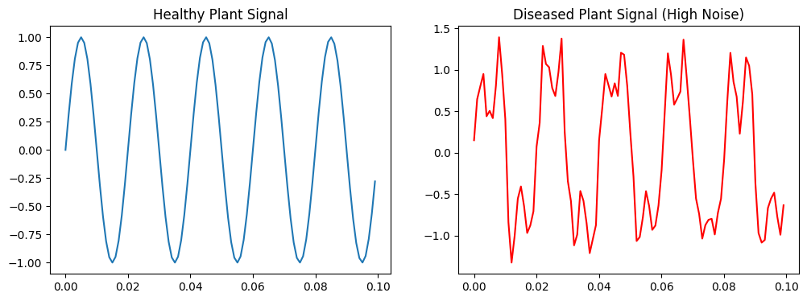

# Embedded Firmware Engineer
### Device Driver Aspirant | Semiconductor & Low-Level Systems Engineer

Embedded Systems Engineer focused on *bare-metal firmware development, device driver fundamentals, and hardware-near software systems. Interested in roles at **Qualcomm, NVIDIA, Microchip, Intel, working on **embedded firmware, Linux drivers, MCU architectures, and real-time systems*.

---

## Core Technical skills

Embedded C | C Programming | Bare-Metal Firmware | Device Drivers (Linux Basics)  
Interrupt Service Routine (ISR) | Real-Time Systems (RTOS Concepts)  
Memory-Mapped I/O | Register-Level Programming | Bit Manipulation  
Microcontrollers | PIC16F | AVR ATMega | ARM Cortex-M (Learning)  
ADC | GPIO | UART | SPI | I2C | PWM  
Embedded Debugging | Signal Analysis | Hardware Interfacing  

---

## Tools & Platforms

- MPLAB X IDE (Firmware Development)
- MPLAB Data Visualizer (Real-time Debugging & Waveform Analysis)
- MATLAB & Simulink (Model-Based Design)
- Proteus (Circuit Simulation)
- Arduino IDE (Prototyping)

---

## 🔬 Projects (Low-Level Embedded Systems Focus)

### Floating Solar Grid Power Theft Detection System
*PIC16F | Embedded C | ISR | ADC | MPLAB X*

- Developed *bare-metal firmware* for real-time monitoring of floating solar power systems using PIC16F microcontroller.
- Implemented *Interrupt Service Routine (ISR)-based architecture* for low-latency anomaly detection.
- Configured *ADC, GPIO, and digital registers* for direct hardware interaction and signal acquisition.
- Performed embedded debugging using *MPLAB Data Visualizer (real-time waveform analysis)*.
- Optimized firmware for deterministic execution in resource-constrained MCU environment.

---

### Transformer Thermal Inertia-Based Load Management System
*Embedded Control Systems | Power Electronics | Smart Grid*

- Designed embedded logic based on transformer thermal response modeling for load optimization.
- Implemented real-time control strategy for preventing thermal overload conditions.
- Focused on embedded decision-making under timing and hardware constraints.

---

### Electrical Signature-Based Plant Health Monitoring System
*Embedded Signal Processing | Sensor Systems*

- Developed non-image-based plant health detection using *electrical impedance / bio-signal analysis*.
- Integrated environmental sensor monitoring for controlled agricultural systems.
- Designed embedded logic for anomaly detection in biological response signals.
- 

---

## Publications & Achievements

- Scopus-indexed publication on *PMMC (Permanent Magnet Moving Coil) instrument optimization*
- 1st place in hardware innovation pitch competitions
- Certifications:
  - MATLAB & Simulink
  - Qualcomm AI Foundations (Edge AI Systems)
  - NPTEL IoT (Score: 77%)

---

## Career Interests

- Embedded Firmware Engineer
- Device Driver Development (Linux / MCU)
- Semiconductor Firmware Engineer
- Embedded Software Engineer
- Hardware Abstraction Layer (HAL) Development
- Real-Time Embedded Systems Engineer

---

## Current Learning Path

- Linux Kernel Fundamentals (Character Device Drivers)
- ARM Cortex-M Firmware Optimization
- Embedded RTOS Concepts (Task Scheduling, Interrupt Handling)
- Edge AI Systems for Semiconductor Applications

---

## 📬 Contact

- LinkedIn: https://www.linkedin.com/in/dolikananda-pichika-484518330?utm_source=share_via&utm_content=profile&utm_medium=member_android
- Email: raok22007@gmail.com
